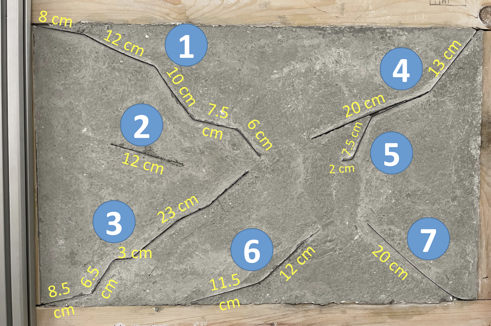

# ABECIS-Results

These are the results for our paper "Developing a Free and Open-source Automated Building Exterior Crack Inspection Software for Construction and Facility Managers" by P. Ko, S. A. Prieto, B. García de Soto from [S.M.A.R.T. Construction Research Group](https://nyuad.nyu.edu/en/research/faculty-labs-and-projects/smart-construction-research-group.html) at New York University Abu Dhabi

The following contains the Intersection Over Union evaluation for images taken in 
- Indoor Lab Controlled Environment, using DJI Matrice 300 RTK Drone (14 images)
- Outdoor Construction Site Environment, using Android Smartphone (14 images)
- Outdoor University Campus, using DJI Matrice 300 RTK Drone (14 images)

Moreover, length estimation Indoor Lab Controlled Environment is also included below.

IOU of 1 means perfect prediction and 0 means all predictions are wrong.

## IOU

### Indoor - Lab

|Image Name   |Image|IOU (Largest to Smallest)|
|-------------|-----|-----|
|lab_00017.jpg||0.999|
|lab_00001.jpg||0.962|
|lab_00003.jpg||0.929|
|lab_00004.jpg||0.853|
|lab_00002.jpg||0.804|
|lab_00008.jpg||0.773|
|lab_00012.jpg||0.694|
|lab_00018.jpg||0.678|
|lab_00006.jpg||0.665|
|lab_00022.jpg||0.642|
|lab_00007.jpg||0.642|
|lab_00011.jpg||0.554|
|lab_00019.jpg||0.509|
|lab_00021.jpg||0.505|

### Outdoor - Construction Site

|Image Name   |Image|IOU (Largest to Smallest)|
|-------------|-----|-----|
|outdoor_site_00197.jpg||0.968|
|outdoor_site_00200.jpg||0.967|
|outdoor_site_00187.jpg||0.946|
|outdoor_site_00201.jpg||0.903|
|outdoor_site_00168.jpg||0.848|
|outdoor_site_00169.jpg||0.839|
|outdoor_site_00003.jpeg||0.252|
|outdoor_site_00001.jpeg||0.120|
|outdoor_site_00002.jpeg||0.089|
|outdoor_site_00178.jpg||0.000|
|outdoor_site_00136.jpg||0.000|
|outdoor_site_00174.jpg||0.000|
|outdoor_site_00195.jpg||0.000|
|outdoor_site_00177.jpg||0.000|

### Outdoor - Drone

|Image Name   |Image|IOU (Largest to Smallest)|
|-------------|-----|-----|
|outdoor_drone_00006.jpg||0.972|
|outdoor_drone_00008.jpg||0.970|
|outdoor_drone_00016.jpg||0.970|
|outdoor_drone_00010.jpg||0.968|
|outdoor_drone_00004.jpg||0.963|
|outdoor_drone_00018.jpg||0.962|
|outdoor_drone_00109.jpg||0.962|
|outdoor_drone_00115.jpg||0.954|
|outdoor_drone_00065.jpg||0.796|
|outdoor_drone_00067.jpg||0.720|
|outdoor_drone_00058.jpg||0.550|
|outdoor_drone_00062.jpg||0.502|
|outdoor_drone_00072.jpg||0.430|
|outdoor_drone_00070.jpg||0.370|

## Length Estimation

As seen above, the measured total length of cracks on the mockup wall is

49.5 + 12 + 41 + 33 + 9.5 + 23.5 + 20 = **188.5 cm**

Below are the results to estimate the total length on the mockup wall using Pixels Per Metric Ratio, sorted by aascending Percentage Error.

|Image Name         |Image|Estimate Total Length (pixels)|Pixels Per Metric Ratio|Estimate Total Length (cm)| % Error|
|-------------|-----|------------|-----|-------|---------|
|lab_00008.jpg||611         |30.55|186    |1        |
|lab_00022.jpg||168         |8.4  |183    |2        |
|lab_00007.jpg||169         |8.45 |194    |2        |
|lab_00002.jpg||727         |36.35|202    |7        |
|lab_00017.jpg||669         |33.45|173    |8        |
|lab_00001.jpg||595         |29.75|207    |9        |
|lab_00012.jpg||609         |30.45|209    |10       |
|lab_00003.jpg||185         |9.25 |164    |12       |
|lab_00018.jpg||604         |30.2 |219    |16       |
|lab_00019.jpg||173         |8.65 |232    |23       |
|lab_00004.jpg||659         |32.95|253    |34       |
|lab_00021.jpg||136         |6.8  |286    |51       |
|lab_00011.jpg||150         |7.5  |290    |53       |
|lab_00006.jpg||516         |25.8 |364    |93       |

