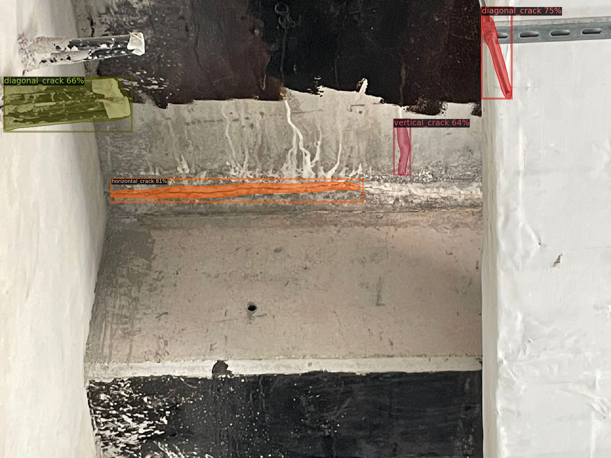
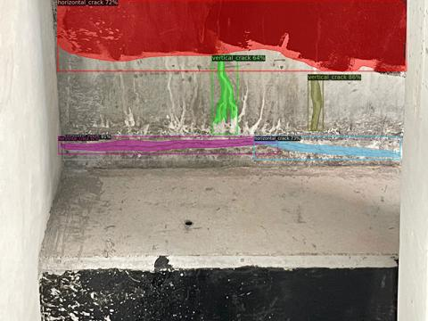
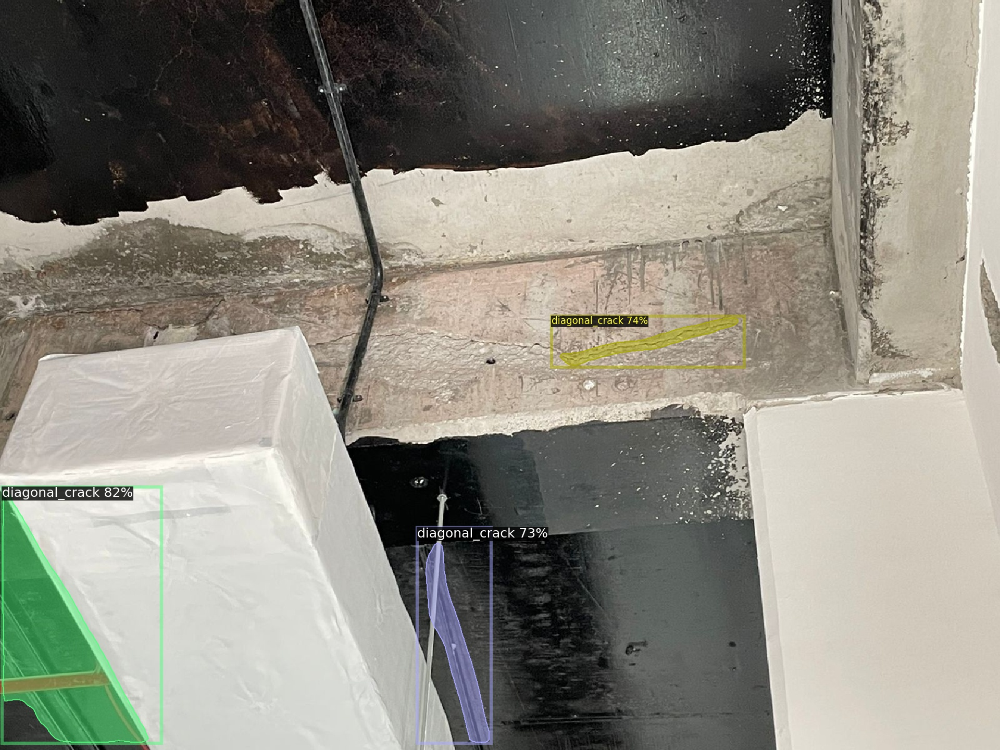

# ABECIS-Results

These are the results for our paper "Developing a Free and Open-source Automated Building Exterior Crack Inspection Software for Construction and Facility Managers" by P. Ko, S. A. Prieto, B. García de Soto from [S.M.A.R.T. Construction Research Group](https://nyuad.nyu.edu/en/research/faculty-labs-and-projects/smart-construction-research-group.html) at New York University Abu Dhabi

The following contains the Intersection Over Union evaluation for images taken in 
- Indoor Lab Controlled Environment, using DJI Matrice 300 RTK Drone (14 images)
- Outdoor Construction Site Environment, using Android Smartphone (14 images)
- Outdoor University Campus, using DJI Matrice 300 RTK Drone (14 images)

Moreover, length estimation Indoor Lab Controlled Environment is also included below.

IOU of 1 means perfect prediction and 0 means all predictions are wrong.

**Everything is arranged in (Largest to Smallest) IoU (All)**

## IOU

### Indoor - Lab

|No |Image Name    |Crack Type(s)                        |Image                |True Positives|False Positives|IoU (All)|IoU (True Positives)|
|---|--------------|-------------------------------------|----------------------------------------------------|--------------|---------------|---------|--------------------|
|1  |lab_00017.jpg |'Diagonal Crack'                     ||8             |0              |0.999    |0.999               |
|2  |lab_00001.jpg |'Diagonal Crack'                     ||7             |0              |0.962    |0.962               |
|3  |lab_00003.jpg |'Diagonal Crack'                     ||5             |0              |0.929    |0.929               |
|4  |lab_00004.jpg |'Diagonal Crack', 'Horizontal Crack' ||7             |1              |0.853    |0.892               |
|5  |lab_00002.jpg |'Diagonal Crack'                     ||9             |1              |0.804    |0.903               |
|6  |lab_00008.jpg |'Diagonal Crack'                     ||7             |0              |0.773    |0.773               |
|7  |lab_00012.jpg |'Diagonal Crack'                     ||7             |1              |0.694    |0.783               |
|8  |lab_00018.jpg |'Diagonal Crack'                     ||8             |0              |0.678    |0.678               |
|9  |lab_00006.jpg |'Diagonal Crack'                     ||7             |1              |0.665    |0.680               |
|10 |lab_00022.jpg |'Diagonal Crack'                     ||5             |0              |0.642    |0.642               |
|11 |lab_00007.jpg |'Diagonal Crack'                     ||5             |0              |0.642    |0.642               |
|12 |lab_00011.jpg |'Diagonal Crack', 'Horizontal Crack' ||5             |1              |0.554    |0.654               |
|13 |lab_00019.jpg |'Diagonal Crack'                     ||5             |1              |0.509    |0.971               |
|14 |lab_00021.jpg |'Diagonal Crack'                     ||4             |1              |0.505    |0.938               |

### Outdoor - Construction Site

|No |Image Name    |Crack Type(s)                        |Image                          |True Positives|False Positives|IoU (All)|IoU  (True Positives)|
|---|--------------|-------------------------------------|----------------------------------------------------|--------------|---------------|---------|---------------------|
|1  |outdoor_site_00197.jpg |'Vertical Crack'                     ||1             |0              |0.968    |0.968                |
|2  |outdoor_site_00200.jpg |'Vertical Crack'                     ||1             |0              |0.967    |0.967                |
|3  |outdoor_site_00187.jpg |'Vertical Crack'                     ||1             |0              |0.946    |0.946                |
|4  |outdoor_site_00201.jpg |'Horizontal Crack'                   ||1             |0              |0.903    |0.903                |
|5  |outdoor_site_00168.jpg |'Diagonal Crack'                     ||2             |0              |0.848    |0.848                |
|6  |outdoor_site_00169.jpg |'Diagonal Crack'                     ||3             |0              |0.839    |0.839                |
|7  |outdoor_site_00003.jpeg |'Diagonal Crack', 'Horizontal Crack', 'Vertical Crack' ||1             |3              |0.252    |0.981                |
|8  |outdoor_site_00001.jpeg |'Horizontal Crack', 'Vertical Crack' ||2             |3              |0.120    |0.976                |
|9  |outdoor_site_00002.jpeg |'Diagonal Crack'                     ||1             |3              |0.089    |0.969                |
|10 |outdoor_site_00178.jpg |'Diagonal Crack', 'Vertical Crack'   ||0             |3              |0.000    |N/A                  |
|11 |outdoor_site_00136.jpg |'Diagonal Crack', 'Horizontal Crack' ||0             |2              |0.000    |N/A                  |
|12 |outdoor_site_00174.jpg |'Vertical Crack'                     ||0             |1              |0.000    |N/A                  |
|13 |outdoor_site_00195.jpg |'Diagonal Crack'                     ||0             |6              |0.000    |N/A                  |
|14 |outdoor_site_00177.jpg |'Diagonal Crack'                     ||0             |1              |0.000    |N/A                  |

### Outdoor - Drone

|No |Image Name    |Crack Type(s)                        |Image                        |True Positives|False Positives|IoU (All)|IoU  (True Positives)|
|---|--------------|-------------------------------------|----------------------------------------------------|--------------|---------------|---------|---------------------|
|1  |outdoor_drone_00006.jpg |'Diagonal Crack'                     ||1             |0              |0.972    |0.972                |
|2  |outdoor_drone_00008.jpg |'Diagonal Crack'                     ||1             |0              |0.970    |0.970                |
|3  |outdoor_drone_00016.jpg |'Diagonal Crack'                     ||1             |0              |0.970    |0.970                |
|4  |outdoor_drone_00010.jpg |'Diagonal Crack'                     ||1             |0              |0.968    |0.968                |
|5  |outdoor_drone_00004.jpg |'Diagonal Crack'                     ||1             |0              |0.963    |0.963                |
|6  |outdoor_drone_00018.jpg |'Diagonal Crack'                     ||1             |0              |0.962    |0.962                |
|7  |outdoor_drone_00109.jpg |'Diagonal Crack'                     ||2             |0              |0.962    |0.962                |
|8  |outdoor_drone_00115.jpg |'Diagonal Crack'                     ||2             |0              |0.954    |0.954                |
|9  |outdoor_drone_00065.jpg |'Diagonal Crack'                     ||3             |0              |0.796    |0.796                |
|10 |outdoor_drone_00067.jpg |'Diagonal Crack'                     ||3             |0              |0.720    |0.720                |
|11 |outdoor_drone_00058.jpg |'Diagonal Crack'                     ||3             |0              |0.550    |0.550                |
|12 |outdoor_drone_00062.jpg |'Diagonal Crack'                     ||1             |0              |0.502    |0.502                |
|13 |outdoor_drone_00072.jpg |'Diagonal Crack'                     ||2             |0              |0.430    |0.430                |
|14 |outdoor_drone_00070.jpg |'Diagonal Crack'                     ||2             |0              |0.370    |0.370                |

## Length Estimation

As seen above, the measured total length of cracks on the mockup wall is
 
43.5 + 12 + 41 + 33 + 9.5 + 23.5 + 20 = **182.5 cm**

Below are the results to estimate the total length on the mockup wall using Pixels Per Metric Ratio, sorted by aascending Percentage Error.

|Image Name         |Image|Estimate Total Length (pixels)|Pixels Per Metric Ratio|Estimate Total Length (cm)| % Error|
|-------------|-----|------------|-----|-------|---------|
|lab_00008.jpg||611         |30.55|186    |1.9      |
|lab_00022.jpg||168         |8.4  |183    |0.3      |
|lab_00007.jpg||169         |8.45 |194    |6.3      |
|lab_00002.jpg||727         |36.35|202    |10.7     |
|lab_00017.jpg||669         |33.45|173    |5.2      |
|lab_00001.jpg||595         |29.75|207    |13.4     |
|lab_00012.jpg||609         |30.45|209    |14.5     |
|lab_00003.jpg||185         |9.25 |164    |10.1     |
|lab_00018.jpg||604         |30.2 |219    |20.0     |
|lab_00019.jpg||173         |8.65 |137    |24.9     |
|lab_00004.jpg||659         |32.95|185    |1.4     |
|lab_00021.jpg||136         |6.8  |182    |0.3     |
|lab_00011.jpg||150         |7.5  |193    |5.8     |
|lab_00006.jpg||516         |25.8 |216    |18.3     |

